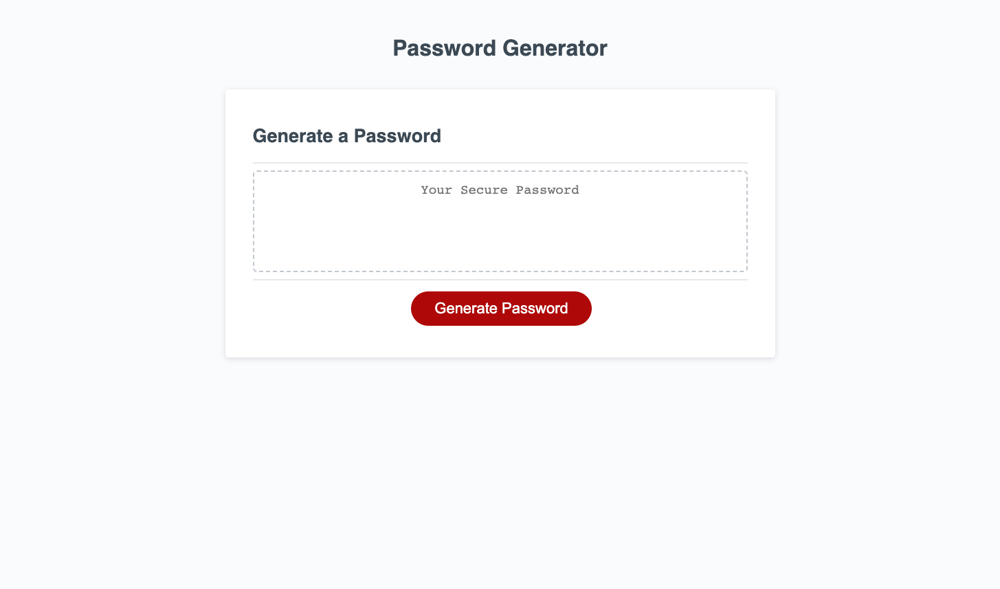

# Password-generator

## Description

This project's goal was to alter code to add functionality for a random password generator application . This was accomplished by adding a function to the preexisting javascript code called "generatePassword". This function accomplished the following directives: 
- when generate password button is clicked, a series of prompts and confirms begins to collect password criteria data from the user
- when invalid data is returned to the prompt inquiring password length, an alert is shown informing the user to use proper data
- when confirms are true, the characters in question are added to a variable of possible characters for the password
- when all prompts and confirms have been answered, a password appears in the text box that is randomly generated using the user's inputs

## Deployed Application

### URL
[Password Generator Deployed Application](https://chesneyjulian.github.io/Password-generator/)
### Screenshot

## Usage
- Click the "Generate Password" button to begin program
- When asked for password length, enter a number between 8 and 128 
- When asked if you would like your password to include certain characters, click "ok" to include these characters and "cancel" to exclude them
- If you would like to see a list of all possible characters for your password after answering all confirms and prompts, open the console using Chrome Dev Tools
- To restart the program, click the "Generate Password" button again
## Resources
This Website gave information regarding the Math.random function when generating strings, as seen on lines 74-82 of script.js file: 

[Programiz | Generate Random Strings](https://www.programiz.com/javascript/examples/generate-random-strings)